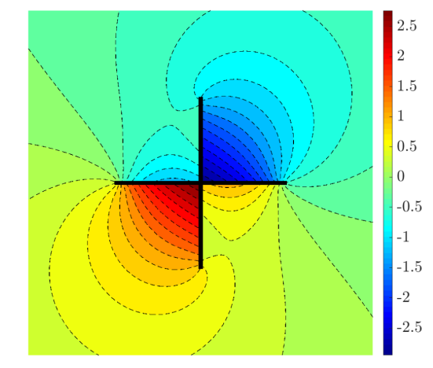
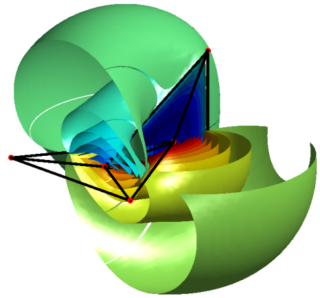

# Boundary Element Methods on non-manifold boundaries, and domain-decomposition preconditioner

 

## Contents

This Matlab/C++ code is a prototype for a 2D and 3D boundary element code to solve integral equations on non-manifold boundaries.
It has been used to obtain the numerical results from [this paper](https://arxiv.org/abs/2310.09204).

The library uses:
- The Matlab toolboxes `openMsh`, `openDom` and `openFem` from [this project](https://github.com/matthieuaussal/gypsilab)
This is code developed by [François Alouges](https://scholar.google.com/citations?user=J5qUvVwAAAAJ&hl=fr) and [Matthieu Aussal](https://fr.linkedin.com/in/matthieu-aussal-1708b245) to handle mesh and finite element integration in 2D and 3D.
- The Matlab toolbox [fracMeshLib](https://github.com/MartinAverseng/FracMeshLib), which contains the "intrinsic inflation" algorithm to convert a `msh` object into a `GeneralizedMesh`, a mesh structure designed for FEM and BEM in non-manifold geometries.
This is based on [this paper](https://www.sciencedirect.com/science/article/pii/S0168874X22001809).
- A self-contained excerpt from the C++ code [bemTools](https://github.com/xclaeys/bemtool) written by [Xavier Claeys](https://claeys.pages.math.cnrs.fr/), contained in `hypersingular.cpp` and `quadrature.cpp`
It implements Duffy-type quadratures to treat the singular integrals in the boundary element method.

## Reproducing the results

To reproduce these results, open Matlab in the folder FiguresScripts and run with appropriate parameters.
Note that the 3D BEM assembling routine requires the use of a mex file which calls a parallel C++ code.
The compilation of the mex file may depend on your specific configuration. If necessary, the call to bemAssembly
can be replaced by slowBemAssembly, which bypasses the mex file and only executes pure Matlab code.

